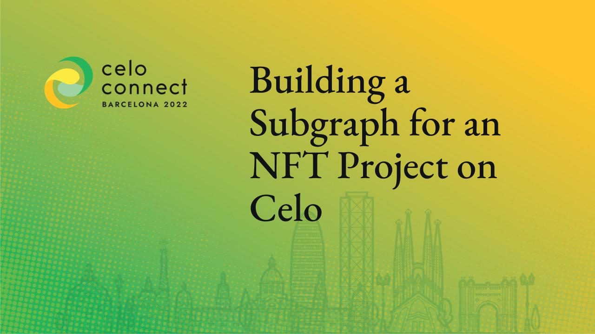

# NFT Subgraph on Celo POAP contracts



- [Contract to index](https://explorer.celo.org/token/0xaB12Cd14E43dbc5F7F3f5571B449BFfa14F444cC/token-transfers)
- [Google Slides for NFT Subgraph Development Workshop](https://docs.google.com/presentation/d/1v34HTuHp9mcGPuiy3FifujhgGgFbEWvEuHfFLj6HOSo/edit?usp=sharing)
- Questions: **[twitter.com/schmid_si](https://twitter.com/schmid_si)**

## Prerequisites

- Install graph-cli: `yarn global add @graphprotocol/graph-cli`

## First Steps

- [Find the contract on Celo Block Explorer](https://explorer.celo.org/token/0xaB12Cd14E43dbc5F7F3f5571B449BFfa14F444cC/token-transfers)
- [Find the contract creation transaction for startBlock](https://explorer.celo.org/tx/0xd0bc372be9ea48fb569116493f639df8a9fcc8a19419aa57b1c6ef76ea7ad1fd/internal-transactions)
- Get a generic ERC721 ABI


- Run this command to initialise the subgraph with events:

```bash
graph init 
    --product hosted-service \
    --protocol ethereum \
    --from-contract 0xaB12Cd14E43dbc5F7F3f5571B449BFfa14F444cC \
    --index-events \
    --contract-name CeloPOAP \
    --network celo \
    --abi ./abis/ERC721.json \
    schmidsi/celo-poap-subgraph celo-poap-subgraph
```

- Inspect the source
– Create new subgraph on [The Graph Hosted Service](https://thegraph.com/hosted-service/) named "Celo POAP Subgraph"
- `graph auth --product hosted-service ...`
- `yarn deploy`

## Remove unused Entities and Events

```graphql
# schema.graphql
type Transfer @entity {
  id: ID!
  from: Bytes! # address
  to: Bytes! # address
  tokenId: BigInt! # uint256
}
```

```yaml
# subgraph.yaml
    mapping:
      kind: ethereum/events
      apiVersion: 0.0.5
      language: wasm/assemblyscript
      entities:
        - Transfer
      abis:
        - name: CeloPOAP
          file: ./abis/CeloPOAP.json
      eventHandlers:
        - event: Transfer(indexed address,indexed address,indexed uint256)
          handler: handleTransfer
      file: ./src/mapping.ts

```

### Extend events

Make them immutable for performance improvements

```graphql
type Transfer @entity(immutable: true) {
  id: ID!
  from: Bytes! # address
  to: Bytes! # address
  tokenId: BigInt! # uint256
  timestamp: BigInt!
  blockNumber: BigInt!
}
```

Use `event.transaction.hash.toHex() + "-" + event.logIndex.toString()` as the id for events
```typescript
export function handleTransfer(event: TransferEvent): void {
  let entity = new Transfer(
    event.transaction.hash.toHex() + "-" + event.logIndex.toString()
  )
  entity.blockNumber = event.block.number;
  entity.timestamp = event.block.timestamp;
  entity.from = event.params.from
  entity.to = event.params.to
  entity.tokenId = event.params.tokenId
  entity.save()
}
```

### Store logical entities

- Identify the important entities: Token, Owner, Contract
- Link them

```graphql
type Transfer @entity(immutable: true) {
  id: ID!
  from: Owner!
  to: Owner!
  token: Token!
  timestamp: BigInt!
  blockNumber: BigInt!
}

type Token @entity {
  id: ID!
  owner: Owner
  uri: String
  transfers: [Transfer!]! @derivedFrom(field: "token")
  contract: Contract
}

type Owner @entity {
  id: Bytes! # Use bytes as ID
  ownedTokens: [Token!]! @derivedFrom(field: "owner")
  balance: BigInt
}

type Contract @entity {
  id: ID!
  name: String
  symbol: String
  totalSupply: BigInt
  mintedTokens: [Token!]! @derivedFrom(field: "contract")
}
```


## Other resources

- https://github.com/Developer-DAO/resources
- https://dev.to/dabit3/the-complete-guide-to-full-stack-ethereum-development-3j13
- https://github.com/itsjerryokolo/CryptoPunks
- https://github.com/dabit3/building-a-subgraph-workshop
- https://thegraph.com/docs/developer/quick-start
- https://thegraph.com/discord
